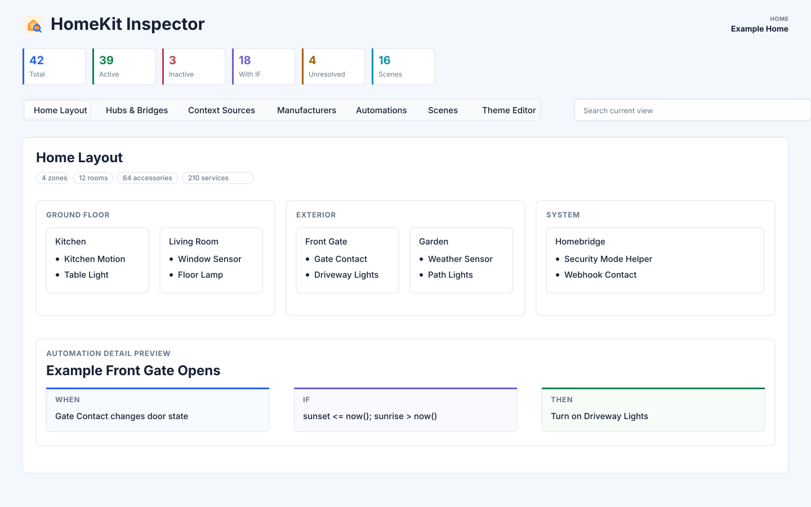

# HomeKit Inspector

Read Apple's local HomeKit database in read-only mode and generate a private,
self-contained HTML inspector for HomeKit structure, automations, scenes, hubs,
bridges, and optional context sources such as Homebridge.

`homed` is Apple's macOS HomeKit daemon (`com.apple.homed`). This project uses
the term only to identify the local system component and its CoreData SQLite
store; the schema is private and unsupported, so extraction logic may need to
change across macOS versions.

The project provides:

- A read-only extractor for `~/Library/HomeKit/core.sqlite`.
- Dynamic CoreData relationship discovery, avoiding hard-coded junction-table
  column numbers where possible.
- Decoding for HomeKit events, actions, scenes, date components, media actions,
  Natural Lighting targets, and Eve/HomeKit predicate conditions.
- A standalone HTML inspector with views for home layout, hubs, bridges,
  context sources, manufacturers, automations, scenes, and theme assignment.
- An optional LAN server for serving a generated inspector report and accepting
  authenticated report updates from the macOS CLI.
- Optional Homebridge context enrichment that adds traceable relationships
  without replacing the raw HomeKit data.
- Local-only theme and override files for private household-specific metadata.



## Project Lineage and Development

HomeKit Inspector is a standalone project focused on local, read-only HomeKit
inspection. It builds on the work published in
[tamengual/homekit-extractor](https://github.com/tamengual/homekit-extractor),
which explored exporting HomeKit data from Apple's local `homed` database and
provided a broader HomeKit-to-Home-Assistant conversion pipeline.

HomeKit Inspector keeps the `homed` SQLite extraction focus, but narrows the
scope to inspection and documentation: richer rule decoding, HomeKit layout and
infrastructure views, optional Homebridge context, local theme assignments, and
a self-contained HTML inspector.

The implementation was developed with assistance from OpenAI Codex. Codex
helped inspect the local CoreData schema, refine read-only SQLite queries,
decode HomeKit/Eve predicate and action payloads, build the HTML viewer, create
synthetic examples, and review the repository for public release.

The project separates raw HomeKit extraction, technical decoding, optional
Homebridge context, and user-maintained annotations. The inspector presents
HomeKit-derived data first, then labels any external context or local metadata.

## Safety Model

This project is designed for inspection and documentation. It does not modify
HomeKit.

- SQLite is opened with `mode=ro`.
- The extractor never writes to `core.sqlite`, `core.sqlite-wal`, or
  `core.sqlite-shm`.
- The tooling does not restart or manipulate `homed`.
- Generated exports and HTML reports are treated as sensitive household data.
- `local-output/`, raw HomeKit database copies, Homebridge configs, and
  private overrides are kept out of version control.

See [docs/PRIVACY.md](docs/PRIVACY.md) for the publishing checklist.
See [CHANGELOG.md](CHANGELOG.md) for release notes.

## Requirements

- macOS with HomeKit configured for the current iCloud user.
- Full Disk Access for the terminal or shell running the extractor.
- Python 3.9+.
- No Python package dependencies are required for extraction or HTML generation.

## Platform Support

HomeKit Inspector is a macOS tool. It depends on user-granted access to the
local `homed` CoreData SQLite store at `~/Library/HomeKit/core.sqlite`.

iOS and iPadOS apps can use the HomeKit entitlement to access Apple's public
HomeKit APIs, but that entitlement does not provide filesystem access to the
system HomeKit database. As a result, this extraction method does not apply to
iPhone or iPad apps, even when they are signed with HomeKit capability.

## Quick Start

Create a local output directory:

```bash
mkdir -p local-output
```

Extract HomeKit from the local `homed` database:

```bash
python3 scripts/homed_extract.py \
  --db ~/Library/HomeKit/core.sqlite \
  -o local-output/homekit_homed_export.json
```

Generate the standalone inspector:

```bash
python3 scripts/generate_inspector.py \
  local-output/homekit_homed_export.json \
  --db ~/Library/HomeKit/core.sqlite \
  --output-dir local-output
```

Open:

```text
local-output/homekit_inspector.html
```

The HTML file is self-contained and can be opened directly in a browser. It
embeds the extracted HomeKit data, so real-home reports belong in private local
storage. The inspector header shows the extraction timestamp from the source
export, making it easier to tell when a static report was captured.

## Repeatable Refresh CLI

The refresh CLI runs extraction, generation, validation, and publication as one
locked operation driven by a private JSON configuration file:

Install it for the current macOS user and migrate an existing private
configuration:

```bash
./install-cli.sh --config /path/to/private-refresh-config.json
```

The default installation uses:

```text
~/.local/bin/homekit-inspector
~/Library/Application Support/HomeKit Inspector/app
~/Library/Application Support/HomeKit Inspector/config.json
~/Library/Application Support/HomeKit Inspector/output
```

Add `~/.local/bin` to `PATH` when it is not already present. The installed
command can then run from any directory without an explicit configuration path:

```bash
homekit-inspector validate-config
homekit-inspector show-config
homekit-inspector refresh
homekit-inspector status
```

Rerunning `install-cli.sh` updates the installed code while preserving private
configuration and outputs. Pass `--config FILE --replace-config` only when the
installed configuration should also be replaced.

The repository-local launcher remains available for development:

```bash
bin/homekit-inspector validate-config \
  --config /path/to/private-refresh-config.json

bin/homekit-inspector show-config \
  --config /path/to/private-refresh-config.json

bin/homekit-inspector refresh \
  --config /path/to/private-refresh-config.json

bin/homekit-inspector status \
  --config /path/to/private-refresh-config.json
```

The launcher uses `python3` by default. Set `HOMEKIT_INSPECTOR_PYTHON` to an
executable name or absolute path to select a specific compatible interpreter.

Start from [examples/refresh-config.example.json](examples/refresh-config.example.json)
or [examples/refresh-config-server.example.json](examples/refresh-config-server.example.json),
and keep the real configuration outside version control. The CLI supports two
publication modes: local HTML generation and signed HTTPS publication to the
optional report server. Secrets remain in separate owner-only files.

The report server reads the inspector file on every request with browser
caching disabled, so the next browser reload sees an atomically published
report. Browser-initiated refresh is intentionally outside this version.

See [docs/REFRESH_CLI.md](docs/REFRESH_CLI.md) for the configuration schema,
installation layout, publication behavior, and failure guarantees.

Uninstall the command and code while preserving private data:

```bash
./uninstall-cli.sh
```

Private configuration and outputs are removed only with the explicit
`--remove-private-data` option.

To generate a demo from the synthetic example without reading a local HomeKit
database:

```bash
python3 scripts/generate_inspector.py \
  examples/sample_output.json \
  --no-db \
  --homebridge-config examples/homebridge-context.example.json \
  --theme-config examples/theme-config.example.json \
  --private-overrides examples/private-overrides.example.json \
  --output-dir local-output/example
```

## Optional Context Sources

The extractor keeps raw HomeKit data intact. Optional context files can add
traceable metadata. For example, a Homebridge `config.json` can identify that a
helper switch is a mode button for a Homebridge security system.

```bash
python3 scripts/generate_inspector.py \
  local-output/homekit_homed_export.json \
  --db ~/Library/HomeKit/core.sqlite \
  --homebridge-config /path/to/homebridge/config.json \
  --output-dir local-output
```

Context enrichment is shown in the **Context Sources** tab and in automation
notes. It should not replace the original `WHEN`, `IF`, or `THEN` extracted
from HomeKit.

## Automation Inspection

HomeKit Inspector focuses on making automation rules readable. The
**Automations** view presents each rule as `WHEN`, `IF`, and `THEN`, with the
devices, rooms, scenes, confidence notes, and unresolved values shown alongside
the rule.

The extractor handles automations created in Apple's Home app and also works
with richer HomeKit rules authored in tools such as Eve, where conditions can
go beyond what Home.app exposes in its UI. Those conditions are decoded from
HomeKit/Eve predicate archives where possible. Values that remain opaque are
shown as unresolved instead of being guessed.

This makes the inspector useful for mixed setups: plain Home automations, Eve
rules with additional conditions, Homebridge helper accessories, webhook
bridges, virtual switches, and other HomeKit-compatible integrations all remain
visible in the same local report.

## Local Theme Assignments

The inspector includes a **Theme Editor** tab. Theme assignments are editorial
metadata, not HomeKit data.

You can let the browser store them in `localStorage`, or pass an explicit local
JSON file:

```bash
python3 scripts/generate_inspector.py \
  local-output/homekit_homed_export.json \
  --db ~/Library/HomeKit/core.sqlite \
  --theme-config local-output/homekit_theme_config.json \
  --output-dir local-output
```

To generate an editable seed from the current heuristic report classification:

```bash
python3 scripts/generate_inspector.py \
  local-output/homekit_homed_export.json \
  --db ~/Library/HomeKit/core.sqlite \
  --write-inferred-theme-config local-output/homekit_theme_config.json \
  --output-dir local-output
```

Review the generated file before reusing it. Automation names, themes, room
names, and device names are private.

When the inspector is served from a LAN host, browser-edited theme assignments
still use `localStorage` and are scoped to the exact browser origin, such as
`https://homekit-inspector.example.net:8099`. To share a consistent configuration
across devices, keep the canonical theme file private on the Mac, regenerate
the HTML with `--theme-config`, and redeploy the generated HTML.

## Optional Report Server

The optional server can run on a Raspberry Pi or another Linux host. It serves
the report and accepts signed publication from an authorized macOS client. It
does not access HomeKit or initiate extraction.

Create private credentials and install the server with the included scripts:

```bash
scripts/create-server-credentials.sh \
  --hostname inspector-server.example.net \
  --output-dir /path/to/private/server-credentials

sudo ./install-server.sh \
  --publish-secret-file /path/to/publish-secret \
  --tls-cert-file /path/to/server-cert.pem \
  --tls-key-file /path/to/server-key.pem \
  --server-config-file /path/to/server.json
```

The installer creates `/etc/homekit-inspector/server.json` with initial
`admin/admin` viewer credentials when no configuration is supplied. Edit that
root-owned file and restart the service to choose different HTTP Basic
credentials. The defaults are intended only for initial access on a trusted
network.

Configure the client with `server` publication:

```json
{
  "publish": {
    "type": "server",
    "url": "https://inspector-server.example.net:8099/api/v1/report",
    "secretFile": "/path/to/publish-secret",
    "caFile": "/path/to/ca.pem",
    "healthUrl": "https://inspector-server.example.net:8099/health"
  }
}
```

Server mode requires HTTPS except for a loopback-only reverse-proxy upstream.
Each request is authenticated with HMAC-SHA256, timestamped, and protected
against replay; the shared secret never travels over the network. See
[docs/SERVER.md](docs/SERVER.md) for credential handling, direct TLS, reverse
proxy, installation, firewall, validation, and rotation guidance.

## Private Overrides

Private overrides cover local facts that cannot be derived from HomeKit or
context sources. They are kept separate from the extractor.

```bash
python3 scripts/generate_inspector.py \
  local-output/homekit_homed_export.json \
  --db ~/Library/HomeKit/core.sqlite \
  --private-overrides local-output/homekit_private_overrides.json \
  --output-dir local-output
```

Overrides are intended for sparse local annotations. Raw HomeKit extraction and
context-source enrichment remain the preferred sources whenever possible.

## Inspector Views

The inspector is organized into dedicated tabs:

- **Home Layout**: zones, rooms, accessories, and named services.
- **Hubs**: Home hubs, reachability, and inferred primary hub.
- **Bridges**: bridge accessories and the bridged accessories they contribute.
- **Context Sources**: optional Homebridge-derived platforms, helpers,
  webhooks, and semantic relations.
- **Manufacturers**: accessories grouped by manufacturer.
- **Capabilities**: accessories grouped by decoded HomeKit service type.
- **Automations**: active/inactive automations with `WHEN`, `IF`, `THEN`,
  scenes, devices, rooms, confidence, and unresolved values.
- **Scenes**: scenes and their actions.
- **Theme Editor**: local assignment of automations to user-defined themes.

The global search box filters the current view. High-volume views also expose
independent contextual filters: zones, rooms, capabilities, manufacturers,
bridges, scene actions, or theme assignments as appropriate. Filter options
remain stable while selections are combined, rather than cascading from one
control into another.

See [docs/EXPLORER.md](docs/EXPLORER.md) for a detailed description of each
tab.

## Project Structure

```text
homekit-inspector/
├── bin/                         # Stable CLI launchers
├── assets/                      # Synthetic inspector images for documentation
├── docs/
│   ├── EXPLORER.md              # Inspector and context-source details
│   ├── PRIVACY.md               # Sensitive-data and publishing checklist
│   ├── REFRESH_CLI.md           # Repeatable refresh and publication workflow
│   ├── SERVER.md                # Secure report server installation and operation
│   ├── SCHEMA.md                # homed CoreData schema notes
│   └── TECHNICAL_APPROACH.md    # Scope, pipeline, and design boundaries
├── examples/
│   ├── homebridge-context.example.json
│   ├── private-overrides.example.json
│   ├── refresh-config.example.json
│   ├── refresh-config-server.example.json
│   ├── theme-config.example.json
│   └── sample_output.json
├── scripts/
│   ├── homed_extract.py
│   ├── generate_condition_diagnostics.py
│   ├── generate_homekit_reports.py
│   ├── homekit_inspector_cli.py
│   ├── generate_inspector.py
│   ├── serve_inspector.py
│   └── create-server-credentials.sh
├── install-cli.sh               # User-scoped CLI installation and updates
├── install-server.sh            # Linux report-server installation entry point
└── uninstall-cli.sh             # Safe removal, preserving private data by default
```

## Demo Assets

The images in `assets/` show the inspector with synthetic example data from
`examples/sample_output.json`. They include one overview image and one image per
main inspector tab:

- [Overview](assets/homekit-inspector-overview.svg)
- [Home Layout](assets/tab-home-layout.svg)
- [Hubs](assets/tab-hubs.svg)
- [Bridges](assets/tab-bridges.svg)
- [Context Sources](assets/tab-context-sources.svg)
- [Manufacturers](assets/tab-manufacturers.svg)
- [Capabilities](assets/tab-capabilities.svg)
- [Automations](assets/tab-automations.svg)
- [Scenes](assets/tab-scenes.svg)
- [Theme Editor](assets/tab-theme-editor.svg)

Real-home screenshots can expose room names, device names, schedules, and
security behavior, so they are best kept out of public repositories.

## Limitations

- The HomeKit database schema is private and can change between macOS releases.
- When the database contains multiple homes, this version inspects the home
  marked as primary by HomeKit and reports that selection in the extraction
  log. Selecting a different home explicitly is planned for a future version.
- Full Disk Access is required because `~/Library/HomeKit/` is TCC-protected.
- Some Eve/HomeKit predicates are partially opaque and may need review.
- Some values are reported as unresolved when the decoder cannot identify them
  confidently.
- Context-source enrichment depends on optional files such as Homebridge
  `config.json`.

## Basis

The project is based on direct observation of Apple's local `homed` CoreData
SQLite database and on local validation of decoded automations against HomeKit
views in Home/Eve. It uses Python standard-library parsers and keeps raw
HomeKit extraction, technical decoding, optional external context, and user
annotations as separate layers.

## Development

Compile-check the Python scripts:

```bash
PYTHONPYCACHEPREFIX=/tmp/homekit-pycache python3 -m py_compile scripts/*.py
```

Generated outputs belong in `local-output/` or another ignored directory.
