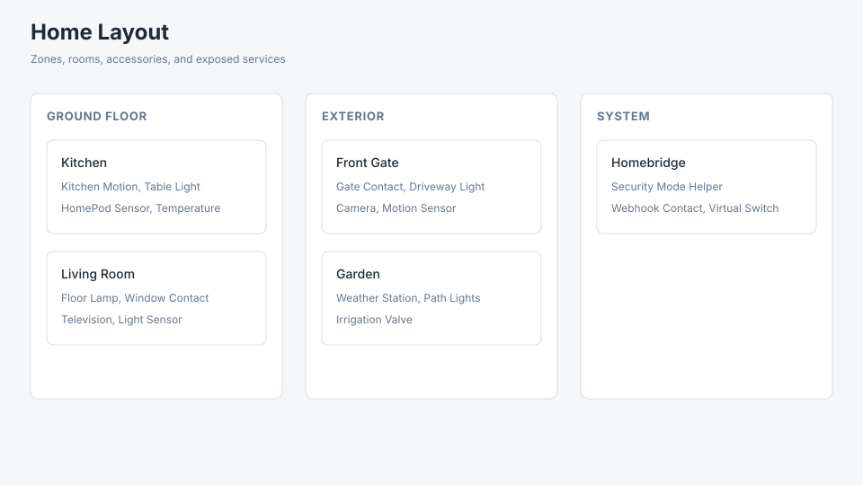
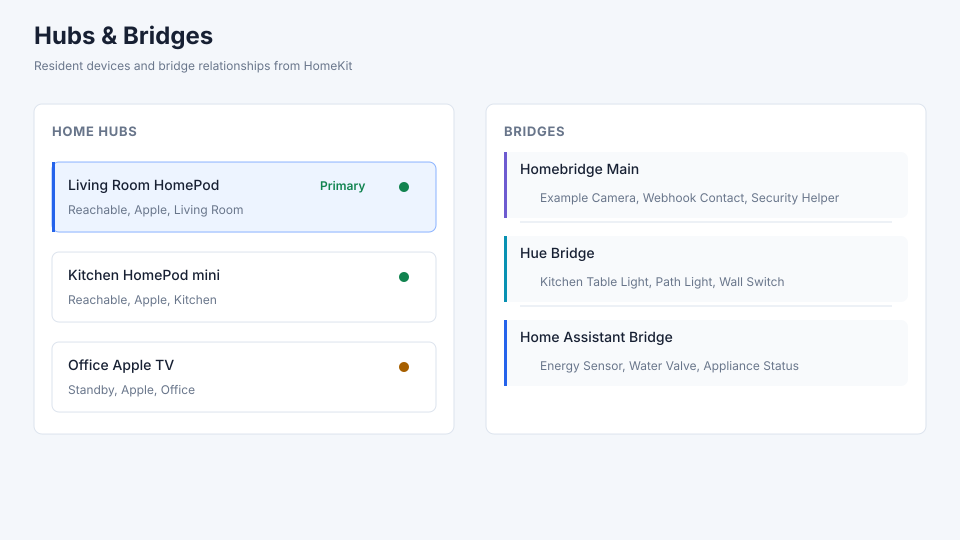
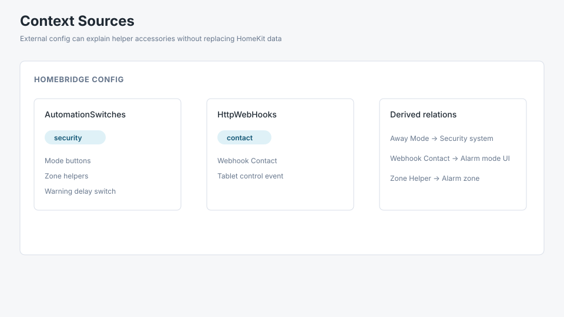
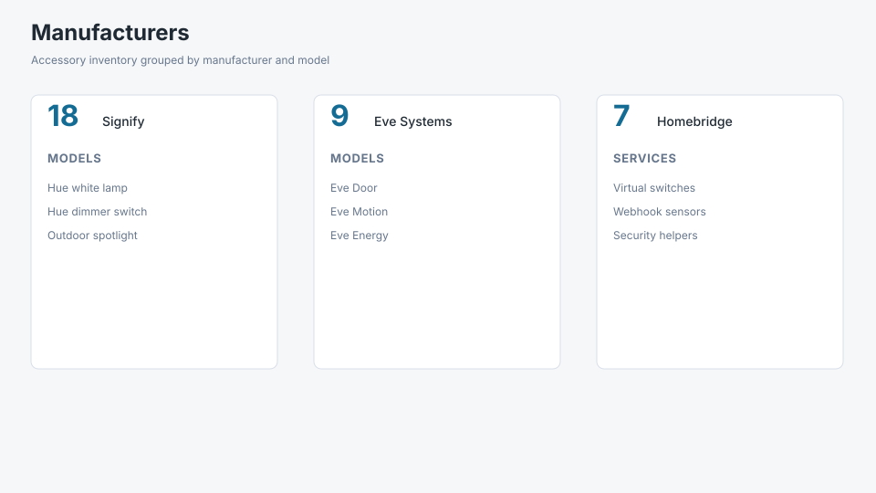
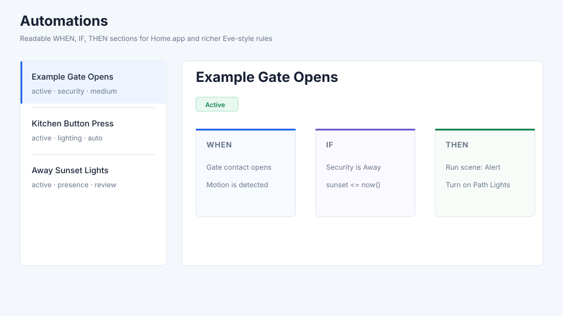
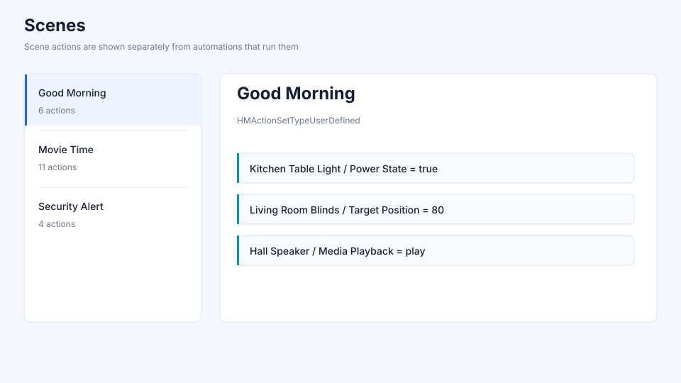
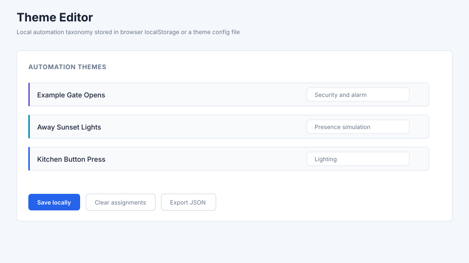

# HomeKit Inspector HTML

`generate_inspector.py` builds a self-contained HTML file from a
`homed_extract.py` JSON export. The inspector is intended for private local
review of a HomeKit installation.

## Inputs

Required:

- `homekit_homed_export.json`: generated by `scripts/homed_extract.py`.

Recommended for a real home:

- `core.sqlite`: opened read-only to enrich layout, scenes, hubs, bridges, and
  predicate references.

Optional:

- `--homebridge-config`: Homebridge `config.json` for context-source
  enrichment.
- `--theme-config`: local theme assignments for the Theme Editor.
- `--private-overrides`: local exceptions that cannot be derived from HomeKit
  or context sources.
- `--no-db`: skip SQLite reads when generating the inspector from synthetic
  example data.

## Recommended Command

```bash
python3 scripts/generate_inspector.py \
  local-output/homekit_homed_export.json \
  --db ~/Library/HomeKit/core.sqlite \
  --homebridge-config /path/to/homebridge/config.json \
  --theme-config local-output/homekit_theme_config.json \
  --private-overrides local-output/homekit_private_overrides.json \
  --output-dir local-output
```

Files in `local-output/` can contain the full HomeKit export and are intended
for local use.

For a synthetic demo that does not read a local HomeKit database:

```bash
python3 scripts/generate_inspector.py \
  examples/sample_output.json \
  --no-db \
  --homebridge-config examples/homebridge-context.example.json \
  --theme-config examples/theme-config.example.json \
  --private-overrides examples/private-overrides.example.json \
  --output-dir local-output/example
```

## Data Model

The generated `homekit_inspector_data.json` has these main sections:

- `metadata`: source and extraction metadata.
- `stats`: counts for automations and unresolved values.
- `zones`: HomeKit zones from the database.
- `layout`: zones, rooms, accessories, and services.
- `infrastructure`: Home hubs, primary hub, bridges, and bridged accessories.
- `contextSources`: optional context loaded from Homebridge or future sources.
- `scenes`: HomeKit scenes and decoded actions.
- `themeConfig`: local theme configuration embedded into the HTML.
- `rules`: automation summaries with `when`, `if`, `then`, devices, rooms,
  confidence, notes, and scene references.

## Views

### Home Layout



Shows the static HomeKit structure: zones, rooms, accessories, and services.
Unnamed HomeKit rooms are labeled with their internal room id rather than being
merged into a generic unassigned bucket.

Use this tab to understand the physical and logical layout of the HomeKit home
before reading automations. It shows which accessories belong to each room, how
rooms are grouped into HomeKit zones, and which named services are exposed by
each accessory. This is useful when a single physical device exposes several
services, such as a camera with a microphone, speaker, motion sensor, or
security system service.

Accessory cards also show automation participation markers when a decoded
automation references that accessory or one of its uniquely named services. The
markers split active and inactive automation references and identify whether
the accessory appears in `WHEN`, `IF`, `THEN`, or through a referenced scene.
Clicking a marker switches to the Automations tab with the accessory name in
the search box.

These markers are intentionally conservative. They are matched from unique
decoded accessory or service names in the generated inspector payload; duplicate
or ambiguous names are not marked. Treat them as practical traceability aids,
not as a full UUID-level dependency graph.

### Hubs



Shows Apple resident devices known to HomeKit, including reachability and the
inferred primary hub when the local database exposes that relationship. Hubs
are operational infrastructure for HomeKit automations and remote access.

### Bridges

Shows bridge relationships found in HomeKit. Bridge mappings are derived from
HomeKit's `ZHOSTACCESSORY` relationship.

The Bridges view groups bridged accessories under the bridge that contributes
them to HomeKit, which helps explain where accessories from Homebridge, Home
Assistant bridges, Hue, Aqara, or similar integrations enter the HomeKit graph.

### Context Sources



Shows optional external context. The current implementation supports
Homebridge `config.json` and can identify:

- Homebridge platforms.
- helper switches from `homebridge-automation-switches`;
- webhooks from Homebridge webhook plugins;
- security-system mode button relations from `homebridge-automation-switches`.

Context sources add traceable metadata. Raw HomeKit events, conditions, and
actions remain visible as extracted.

This tab is not a replacement for HomeKit data. It explains local helper
accessories when an external configuration file can be connected to what
HomeKit exposes. For example, a Homebridge security helper switch can be shown
as a security mode button while the underlying HomeKit trigger still remains
visible as a switch or security-system service.

### Manufacturers



Shows accessories grouped by manufacturer, using the manufacturer and model
values exposed in HomeKit. This is useful for auditing device families,
spotting bridge-imported accessories, and understanding whether a group of
automations depends heavily on a single vendor or integration.

### Automations



Shows each automation as:

- `WHEN`: event triggers.
- `IF`: decoded predicates or conditions.
- `THEN`: action sets, scene references, and characteristic writes.
- devices and rooms involved.
- confidence and unresolved-value flags.

The list is sorted alphabetically and can be filtered by status, theme, room,
and confidence.

This is the main rule-inspection tab. It is designed for automations created in
Apple's Home app and for richer HomeKit rules authored in apps such as Eve.
HomeKit Inspector reads the stored HomeKit rule objects and decodes HomeKit/Eve
predicate archives where possible, so conditions that are incomplete or hard to
review in Home.app can still appear in the `IF` section.

`WHEN` shows the event side of the rule: time triggers, significant-time
events, characteristic changes, button events, contact sensors, motion sensors,
presence events, or other HomeKit trigger objects. `IF` shows conditions decoded
from the evaluation predicate. `THEN` shows characteristic writes and scene
references. When an automation runs a scene, the automation tab names the scene;
the scene's own actions are shown in the Scenes tab.

Confidence labels identify decoded conditions, unresolved values, or rules that
need visual review in Home/Eve. Unresolved values are kept visible because they
often point to HomeKit-specific encodings, vendor-specific services, or rule
types that need another decoder pass.

### Scenes



Shows HomeKit scenes separately from automations. Automations can reference a
scene, but scene details stay in the Scenes view to avoid duplicating actions.

Use this tab to inspect what a scene actually changes. This is especially
important when an automation's `THEN` section says only that it runs a scene:
the automation explains when and why the scene runs, while the scene view
explains which accessories and characteristics the scene changes.

### Theme Editor



Themes are user editorial metadata. They are not extracted from HomeKit.

Assignments are stored in browser `localStorage` or loaded from
`--theme-config`. Use export/import from the UI to move assignments between
machines.

This tab lets the user group automations into local themes such as security,
presence simulation, lighting, access, climate, or any other taxonomy that fits
the installation. Theme assignments are local metadata and do not alter the
HomeKit export.

## Data Layers

The inspector keeps four layers separate:

1. raw HomeKit extraction;
2. technical decoding from HomeKit blobs and predicates;
3. context-source enrichment from verifiable external configuration;
4. private overrides for unresolved local exceptions.

Overrides are useful for local naming or semantic corrections. They do not
replace extracted triggers, conditions, or actions.

## Output Safety

The HTML file embeds the full JSON payload. It may contain:

- room and device names;
- automation logic;
- alarm/security semantics;
- bridge topology;
- scene actions;
- household schedules.

Reports generated from an actual home are private artifacts and are intended
for local review.
